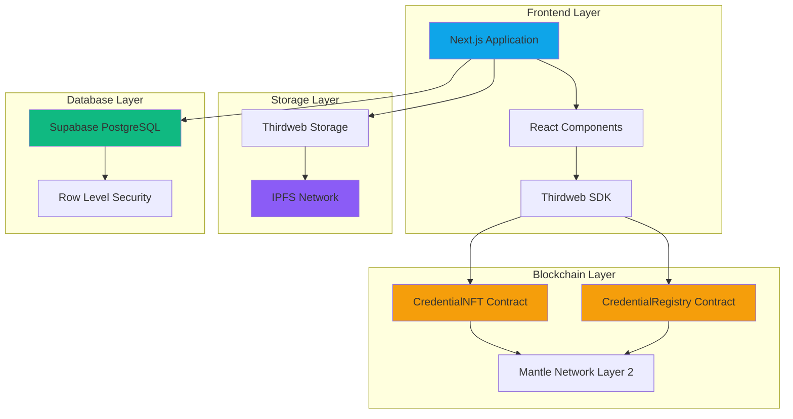
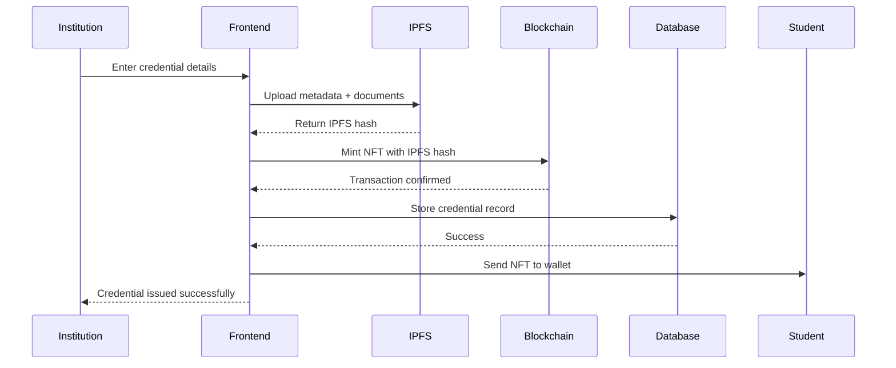
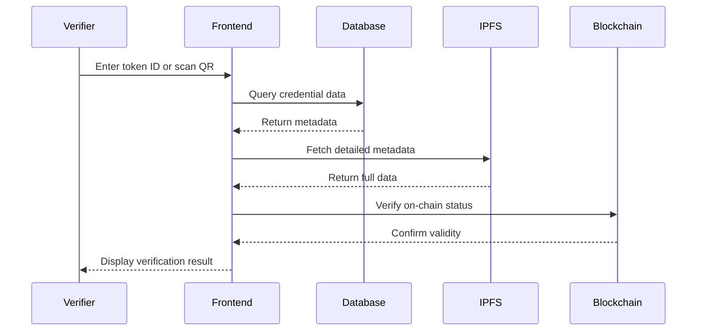

# ACREDIA

<div align="center">
  
  
  ### Blockchain-Based Academic Credential Verification System
  
  *Secure, Transparent, and Tamper-Proof Educational Credentials on Mantle Network*


---

### 🎯 Built on Mantle Network Layer 2

**Ultra-low gas fees** • **Lightning-fast transactions** • **Ethereum security** • **EVM compatible**

[🌐 Mantle Network](https://mantle.xyz) | [📊 MantleScan Explorer](https://sepolia.mantlescan.xyz) | [💧 Get Test MNT](https://faucet.sepolia.mantle.xyz)

</div>

---

## 📑 Table of Contents

- [Overview](#-overview)
- [Why Mantle Network](#-why-mantle-network)
- [The Problem](#-the-problem)
- [Our Solution](#-our-solution)
- [Screenshots](#-screenshots)
- [Key Features](#-key-features)
- [Smart Contracts](#-smart-contracts)
- [Technology Stack](#-technology-stack)
- [System Architecture](#-system-architecture)
- [How It Works](#-how-it-works)
- [Getting Started](#-getting-started)
- [Environment Setup](#-environment-setup)
- [Usage Guide](#-usage-guide)
- [Project Structure](#-project-structure)
- [Team](#-team)

---

## 🌟 Overview

**Acredia** is a revolutionary decentralized platform that transforms how academic credentials are issued, stored, and verified. Built on **Mantle Network**, a high-performance Layer 2 blockchain, Acredia leverages cutting-edge blockchain technology, IPFS, and modern web technologies to eliminate credential fraud, reduce verification time, and provide lifetime access to verified academic records.

### Why Acredia?

Traditional paper-based or centralized digital credentials suffer from:

- Easy forgery and tampering
- Time-consuming verification processes
- Risk of loss or damage
- Limited accessibility
- Centralized control and single points of failure

Acredia solves these problems by creating **immutable, blockchain-verified credentials** that are:

- ✅ Permanent and tamper-proof
- ✅ Instantly verifiable
- ✅ Decentralized and censorship-resistant
- ✅ Accessible anywhere, anytime
- ✅ Privacy-preserving with student control

---

## 🚀 Why Mantle Network?

Acredia is built on **Mantle Network**, an Ethereum Layer 2 scaling solution that offers significant advantages:

### Key Benefits

**💰 Ultra-Low Transaction Costs**

- Drastically reduced gas fees compared to Ethereum mainnet
- Makes credential issuance affordable for educational institutions
- Students can claim credentials without worrying about high costs

**⚡ High Performance**

- Fast transaction finality (typically under 2 seconds)
- Instant credential verification
- Improved user experience with near-instant confirmations

**🔒 Ethereum Security**

- Inherits Ethereum's security through Layer 2 architecture
- Modular design with optimistic rollups
- Battle-tested smart contract standards (OpenZeppelin)

**🌍 EVM Compatibility**

- Full compatibility with Ethereum tooling and infrastructure
- Seamless integration with MetaMask and other Web3 wallets
- Easy migration and deployment of Solidity contracts

**♻️ Eco-Friendly**

- Significantly lower energy consumption than Layer 1 solutions
- Supports sustainable blockchain applications
- Reduced carbon footprint for credential management

### Network Details

- **Mantle Sepolia Testnet**: Chain ID 5003
- **Mantle Mainnet**: Chain ID 5000
- **Block Explorer**: [MantleScan](https://mantlescan.xyz)
- **RPC Endpoints**: High-availability infrastructure for reliable connections

---

## 🎯 The Problem

The current academic credential system faces critical challenges:

1. **Credential Fraud**: Fake degrees and certificates cost employers billions annually
2. **Slow Verification**: Manual verification takes days or weeks
3. **Institutional Dependency**: Students rely on institutions to provide transcripts
4. **Data Loss**: Physical documents can be lost, damaged, or destroyed
5. **Privacy Concerns**: Sharing full credentials when only partial verification is needed

---

## 💡 Our Solution

Acredia creates a **three-layer verification system** powered by Mantle Network:

1. **Blockchain Layer**: Immutable credential records on Mantle Network (Layer 2)
2. **Storage Layer**: Decentralized metadata storage on IPFS
3. **Database Layer**: Fast querying and indexing via Supabase

This architecture ensures credentials are:

- **Permanent**: Stored on blockchain forever
- **Cost-Effective**: Low gas fees on Mantle Network make issuance affordable
- **Fast**: Near-instant transaction finality
- **Verifiable**: Instant verification via token ID or QR code
- **Decentralized**: No single point of failure
- **Detailed**: Subject-wise marks, grades, and complete academic records
- **Accessible**: Students own their credentials via NFTs

---

## 📸 Screenshots

### Landing Page


_Modern, responsive landing page showcasing the platform's features_

### Student Dashboard


_Students can view all their credentials with detailed information and blockchain verification_

### Institution Dashboard


_Institutions can issue credentials with subject-wise marks, grades, and complete academic records_

### Credential Verification


_Public verification page with blockchain proof and comprehensive credential details_


_Detailed subject-wise performance and blockchain transaction information_

### Admin Panel


_Contract owner dashboard for authorizing institutions and monitoring system statistics_

---

## ⚡ Key Features

### For Students

- **Digital Wallet**: Receive credentials as NFTs in your wallet
- **Instant Access**: View all credentials anytime, anywhere
- **Easy Sharing**: Generate QR codes or shareable verification links
- **Subject Details**: Access complete subject-wise marks and grades
- **Lifetime Ownership**: Credentials stored permanently on blockchain

### For Institutions

- **Simple Issuance**: Issue credentials with an intuitive web interface
- **Subject-Wise Records**: Add detailed marks, grades, and performance data
- **Batch Processing**: Upload credentials for multiple students
- **Blockchain Verification**: Each credential is verifiable on-chain
- **Authorization Control**: Admin-approved issuer system

### For Verifiers (Employers/Universities)

- **Instant Verification**: Verify credentials in seconds via token ID or QR code
- **Blockchain Proof**: Direct links to blockchain transactions
- **Complete Details**: View student information, institution, marks, and grades
- **No Login Required**: Public verification page accessible to anyone
- **Tamper-Proof**: Impossible to forge or modify credentials

### For Administrators

- **Authorization Management**: Approve institutions to issue credentials
- **System Statistics**: Real-time dashboard with credential counts
- **Contract Ownership**: Full control over smart contract parameters
- **Security**: Only contract owner can authorize new issuers

---

## 📜 Smart Contracts

Acredia uses two main smart contracts deployed on **Mantle Sepolia Testnet**:

### CredentialNFT Contract

**Purpose**: ERC-721 NFT contract for issuing academic credentials

**Key Features**:

- ERC-721 standard compliance for maximum compatibility
- ERC-721URIStorage for IPFS metadata links
- Ownable pattern with authorized issuer system
- Revocation mechanism for invalid credentials

**Key Functions**:

- `issueCredential(address student, string credentialHash, string uri)` - Issue new credential NFT
- `authorizeIssuer(address issuer)` - Authorize institution to issue credentials (owner only)
- `revokeIssuer(address issuer)` - Revoke institution authorization (owner only)
- `revokeCredential(uint256 tokenId)` - Revoke a credential if needed
- `authorizedIssuers(address)` - Check if address is authorized
- `credentialHashes(uint256)` - Get credential hash by token ID
- `credentialIssuers(uint256)` - Get issuer address by token ID
- `revokedCredentials(uint256)` - Check if credential is revoked

### CredentialRegistry Contract

**Purpose**: Central registry for tracking all credentials and their metadata

**Key Features**:

- Immutable record of all issued credentials
- Efficient lookup by token ID or credential hash
- Timestamp tracking for issuance verification
- Public verification without authentication

**Key Functions**:

- `registerCredential(tokenId, student, issuer, credentialHash, ipfsHash)` - Register credential
- `verifyCredential(string credentialHash)` - Verify and retrieve credential details
- `getCredentialByTokenId(uint256 tokenId)` - Get credential by token ID
- `getAllCredentials()` - Get list of all credential hashes
- `getTotalCredentials()` - Get total number of credentials issued

### Contract Architecture

```solidity
// CredentialNFT - ERC721 with authorization system
contract CredentialNFT is ERC721, ERC721URIStorage, Ownable {
    mapping(address => bool) public authorizedIssuers;
    mapping(uint256 => string) public credentialHashes;
    mapping(uint256 => bool) public revokedCredentials;
}

// CredentialRegistry - Central tracking system
contract CredentialRegistry is Ownable {
    struct CredentialRecord {
        uint256 tokenId;
        address studentWallet;
        address issuerWallet;
        string credentialHash;
        string ipfsHash;
        uint256 issuedAt;
        bool exists;
    }
}
```

### Deployment Information

**Network**: Mantle Sepolia Testnet (Chain ID: 5003)  
**Compiler**: Solidity 0.8.23  
**Optimization**: Enabled (200 runs)  
**Dependencies**: OpenZeppelin Contracts 4.9.6  
**Block Explorer**: [MantleScan Sepolia](https://sepolia.mantlescan.xyz)

### 📍 Deployed Contract Addresses

#### Mantle Sepolia Testnet

**CredentialNFT Contract**  
📜 [`0xfC2f2614dF998f9b07075A5a02939825E6cde04a`](https://sepolia.mantlescan.xyz/address/0xfC2f2614dF998f9b07075A5a02939825E6cde04a)

**CredentialRegistry Contract**  
📜 [`0x46C29C7572772936AA7f9FC3fA18084f2fa82fA6`](https://sepolia.mantlescan.xyz/address/0x46C29C7572772936AA7f9FC3fA18084f2fa82fA6)

> **📝 Deployment Instructions**:
>
> 1. Run `cd contracts && pnpm deploy:mantle-sepolia`
> 2. Copy the deployed contract addresses from the console output
> 3. Update your `frontend/.env.local` with the addresses
> 4. Verify contracts on MantleScan using the verification command
> 5. Update this README with your deployed addresses

> **⚠️ Important**: Always verify contract addresses on MantleScan before interacting with them. Never trust addresses from unofficial sources.

---

## 🛠 Technology Stack

### Frontend

- **Next.js 16** - React framework with App Router for optimal performance
- **TypeScript** - Type-safe development
- **Tailwind CSS** - Utility-first styling
- **Radix UI** - Accessible component primitives
- **Thirdweb SDK** - Wallet connection and blockchain interactions
- **Lucide React** - Modern icon library

### Blockchain

- **Solidity 0.8.23** - Smart contract language
- **Hardhat** - Development environment and testing framework
- **Mantle Network** - Layer 2 blockchain deployment (Sepolia Testnet & Mainnet)
- **Ethers.js v5** - Ethereum library for blockchain interactions
- **OpenZeppelin 4.9.6** - Secure and audited contract libraries
- **MantleScan** - Block explorer for transaction verification

### Storage & Backend

- **IPFS** - Decentralized metadata storage via Thirdweb
- **Supabase** - PostgreSQL database with Row Level Security
- **PostgreSQL** - Relational database for indexing
- **RESTful APIs** - Custom API routes in Next.js

### Development Tools

- **pnpm** - Fast, disk-efficient package manager
- **ESLint** - Code quality
- **Prettier** - Code formatting
- **Git** - Version control

---

## 🏗 System Architecture



### Architecture Layers

1. **Presentation Layer**: User interfaces for students, institutions, and verifiers
2. **Application Layer**: Business logic, authentication, and API routes
3. **Blockchain Layer**: Smart contracts deployed on Mantle Network Layer 2 for low-cost, high-speed transactions
4. **Storage Layer**: IPFS for decentralized metadata storage ensuring data persistence
5. **Database Layer**: Supabase for fast queries and off-chain indexing with Row Level Security

### Why This Architecture?

**Scalability**: Mantle Network's Layer 2 solution allows thousands of credentials to be issued without network congestion

**Cost-Efficiency**: Dramatically reduced gas fees compared to Ethereum mainnet make the system economically viable for educational institutions

**Security**: Multi-layer approach ensures data integrity - blockchain for immutability, IPFS for decentralization, and Supabase for access control

**Performance**: Near-instant transaction finality on Mantle Network provides excellent user experience

---

## 🔄 How It Works

### Credential Issuance Flow



### Verification Flow



### Step-by-Step Process

#### For Institutions (Issuing Credentials)

1. **Connect Wallet**: Institution connects authorized wallet
2. **Enter Student Details**: Name, wallet address, credential type
3. **Add Academic Data**: Degree, major, GPA, issue date
4. **Add Subject Marks**: Subject name, marks obtained, maximum marks, grade
5. **Upload to IPFS**: System uploads metadata to decentralized storage
6. **Mint NFT**: Smart contract mints credential NFT to student's wallet on Mantle Network
7. **Database Record**: System creates searchable database entry
8. **Confirmation**: Student receives NFT in their wallet (typically within 2 seconds on Mantle)

#### For Students (Viewing Credentials)

1. **Login**: Authenticate with email or wallet
2. **Dashboard**: View all issued credentials as NFTs
3. **Details**: Click credential to see complete information stored on Mantle blockchain
4. **Share**: Generate QR code or verification link
5. **Download**: Export credential details or share blockchain proof from MantleScan

#### For Verifiers (Checking Credentials)

1. **Access**: Navigate to public verification page (no login required)
2. **Input**: Enter credential token ID or scan QR code
3. **Verification**: System checks Mantle blockchain and IPFS
4. **Results**: View complete credential details with blockchain proof
5. **Confirmation**: Verify authenticity via MantleScan blockchain explorer link

---

## 🚀 Getting Started

### Quick Start Guide

> **TL;DR**: Set up MetaMask with Mantle Sepolia → Get test MNT → Clone repo → Install dependencies → Configure `.env` files → Deploy contracts → Run frontend

### Prerequisites

Before you begin, ensure you have the following installed:

- **Node.js** (v18 or higher) - [Download](https://nodejs.org/)
- **pnpm** (v8 or higher) - Install via: `npm install -g pnpm`
- **Git** - [Download](https://git-scm.com/)
- **MetaMask** or compatible Web3 wallet - [Install](https://metamask.io/)
- **Test MNT Tokens** - Get from [Mantle Sepolia Faucet](https://faucet.sepolia.mantle.xyz)

### Installation

1. **Clone the Repository**

```powershell
git clone https://github.com/thisisouvik/Arcedia.git
cd Arcedia
```

2. **Install Frontend Dependencies**

```powershell
cd frontend
pnpm install
```

3. **Install Contract Dependencies**

```powershell
cd ../contracts
pnpm install
```

### Configuration

4. **Set Up Environment Variables**

Create a `.env.local` file in the `frontend` directory:

```env
# Thirdweb Configuration
NEXT_PUBLIC_THIRDWEB_CLIENT_ID=your_thirdweb_client_id

# Smart Contract Addresses (Mantle Sepolia Testnet)
NEXT_PUBLIC_CREDENTIAL_NFT_CONTRACT=0x_your_nft_contract_address
NEXT_PUBLIC_CREDENTIAL_REGISTRY_CONTRACT=0x_your_registry_contract_address

# Network Configuration
NEXT_PUBLIC_CHAIN_ID=5003
NEXT_PUBLIC_NETWORK_NAME=mantleSepolia

# Supabase Configuration
NEXT_PUBLIC_SUPABASE_URL=https://your-project.supabase.co
NEXT_PUBLIC_SUPABASE_ANON_KEY=your_supabase_anon_key

# IPFS Storage (via Thirdweb)
NEXT_PUBLIC_NFT_STORAGE_KEY=your_thirdweb_storage_key
```

Create a `.env` file in the `contracts` directory:

```env
# Wallet Private Key (for deployment - NEVER commit this!)
PRIVATE_KEY=your_wallet_private_key_without_0x

# MantleScan API Key (for contract verification)
MANTLESCAN_API_KEY=your_mantlescan_api_key

# Optional: RPC URL (uses public RPC if not specified)
MANTLE_SEPOLIA_RPC=https://rpc.sepolia.mantle.xyz
MANTLE_MAINNET_RPC=https://rpc.mantle.xyz
```

### Database Setup

5. **Set Up Supabase Database**

Run the following SQL scripts in your Supabase SQL Editor:

```sql
-- Run these in order:
1. frontend/database_schema.sql
2. frontend/FIX_DATABASE_RLS.sql
3. frontend/enable_public_verification.sql
4. frontend/enable_admin_stats.sql
```

### Smart Contract Deployment

6. **Compile and Deploy Contracts**

```powershell
cd contracts

# Compile contracts
pnpm compile

# Deploy to Mantle Sepolia Testnet
pnpm deploy:mantle-sepolia

# Deploy to Mantle Mainnet (when ready for production)
pnpm deploy:mantle-mainnet
```

7. **Verify Contracts on MantleScan**

```powershell
# Verify CredentialNFT
pnpm hardhat verify --network mantleSepolia YOUR_NFT_CONTRACT_ADDRESS

# Verify CredentialRegistry
pnpm hardhat verify --network mantleSepolia YOUR_REGISTRY_CONTRACT_ADDRESS
```

**Note**: After deployment, copy the contract addresses from the console output and update your `frontend/.env.local` file with the new addresses.

### Running the Application

8. **Start the Development Server**

```powershell
cd frontend
pnpm dev
```

9. **Open in Browser**

Navigate to [http://localhost:3000](http://localhost:3000)

### Production Build

```powershell
cd frontend
pnpm build
pnpm start
```

---

## ⚙️ Environment Setup

### Getting API Keys

#### Thirdweb Client ID

1. Visit [Thirdweb Dashboard](https://thirdweb.com/dashboard)
2. Create a new project
3. Copy your Client ID
4. Configure for Mantle Network support

#### Supabase Setup

1. Create account at [Supabase](https://supabase.com)
2. Create a new project
3. Get your project URL and anon key from Settings > API
4. Run the provided SQL scripts in SQL Editor (in order):
   - `sql/database_schema.sql`
   - `sql/FIX_DATABASE_RLS.sql`
   - `sql/enable_public_verification.sql`
   - `sql/enable_admin_stats.sql`

#### MantleScan API Key (for contract verification)

1. Visit [MantleScan](https://mantlescan.xyz)
2. Create an account or sign in
3. Navigate to API Keys section
4. Generate a new API key
5. Add to your `.env` file as `MANTLESCAN_API_KEY`

#### NFT.Storage / Thirdweb Storage

1. Visit [Thirdweb Storage](https://thirdweb.com/storage) (recommended)
2. Or use [NFT.Storage](https://nft.storage/) as alternative
3. Generate API token for IPFS uploads

### Wallet Setup for Mantle Network

1. **Install MetaMask** browser extension
2. **Create or import wallet**
3. **Add Mantle Sepolia Testnet** to MetaMask:

   **Manual Configuration:**

   - Network Name: `Mantle Sepolia Testnet`
   - RPC URL: `https://rpc.sepolia.mantle.xyz`
   - Chain ID: `5003`
   - Currency Symbol: `MNT`
   - Block Explorer: `https://sepolia.mantlescan.xyz`

   **Or use Chainlist:**

   - Visit [Chainlist](https://chainlist.org)
   - Search for "Mantle Sepolia"
   - Click "Add to MetaMask"

4. **Get Test MNT Tokens**:

   - Visit [Mantle Sepolia Faucet](https://faucet.sepolia.mantle.xyz)
   - Connect your wallet
   - Request test MNT tokens
   - Tokens usually arrive within 1-2 minutes

5. **For Mainnet Deployment** (Production):
   - Network Name: `Mantle`
   - RPC URL: `https://rpc.mantle.xyz`
   - Chain ID: `5000`
   - Currency Symbol: `MNT`
   - Block Explorer: `https://mantlescan.xyz`

---

## 📖 Usage Guide

### For Administrators

**Authorizing Institutions**

1. Connect the contract owner wallet
2. Navigate to Admin Dashboard
3. Enter institution wallet address
4. Click "Authorize Wallet"
5. Confirm blockchain transaction
6. Institution can now issue credentials

### For Institutions

**Issuing a Credential**

1. Login with authorized institution account
2. Go to Dashboard > Issue Credential tab
3. Fill in student details:
   - Student Name
   - Student Wallet Address
   - Credential Type (Degree, Certificate, etc.)
   - Degree/Major/GPA
   - Issue Date
4. Add subjects (click "+ Add Subject"):
   - Subject Name
   - Marks Obtained
   - Maximum Marks
   - Grade (optional)
5. Click "Issue Credential"
6. Confirm wallet transaction
7. Wait for confirmation
8. Student receives NFT in their wallet

**Viewing Issued Credentials**

1. Go to Dashboard > Issued Credentials tab
2. View all credentials issued by your institution
3. See blockchain transaction hashes
4. Access IPFS metadata links

### For Students

**Viewing Your Credentials**

1. Login with student account
2. Dashboard displays all your credentials
3. Click on any credential to see:
   - Institution details
   - Credential type and dates
   - Subject-wise marks and grades
   - Overall performance statistics
   - Blockchain verification proof

**Sharing Credentials**

1. Click "Share" on any credential
2. Options:
   - Generate QR Code
   - Copy verification link
   - Share token ID
3. Recipients can verify without login

### For Verifiers (Employers/Universities)

**Verifying Credentials**

1. Go to verification page (no login required)
2. Enter credential token ID OR scan QR code
3. View complete credential details:
   - Student information
   - Issuing institution
   - Academic records
   - Subject-wise performance
   - Blockchain proof
4. Click blockchain link to verify on MantleScan
5. Confirm credential is authentic and not revoked on Mantle Network

---

## 📁 Project Structure

### Frontend Directory Structure

```
frontend/
├── public/
│   ├── logo.png                    # Acredia logo
│   ├── Acredia.png                 # Brand assets
│   └── screenshots/                # UI screenshots
├── src/
│   ├── app/
│   │   ├── page.tsx               # Landing page
│   │   ├── layout.tsx             # Root layout with providers
│   │   ├── globals.css            # Global styles
│   │   ├── about/
│   │   │   └── page.tsx           # About page
│   │   ├── admin/
│   │   │   └── page.tsx           # Admin dashboard
│   │   ├── api/
│   │   │   └── admin/
│   │   │       ├── stats/route.ts          # Statistics API
│   │   │       └── update-authorization/   # Authorization sync
│   │   ├── auth/
│   │   │   ├── login/             # Student/Institution login
│   │   │   ├── register/          # User registration
│   │   │   ├── admin-login/       # Admin authentication
│   │   │   └── admin-setup/       # Initial admin setup
│   │   ├── dashboard/
│   │   │   └── page.tsx           # User dashboard
│   │   └── verify/
│   │       └── page.tsx           # Public verification page
│   ├── components/
│   │   ├── institution/
│   │   │   ├── AuthorizeIssuer.tsx           # Authorization UI
│   │   │   ├── CredentialUploadForm.tsx      # Issuance form
│   │   │   └── IssuedCredentialsList.tsx     # Issued credentials
│   │   ├── student/
│   │   │   ├── StudentCredentialsList.tsx    # Student's credentials
│   │   │   ├── QRCodeModal.tsx              # QR code display
│   │   │   └── CredentialDiagnostic.tsx     # Debug component
│   │   ├── verification/
│   │   │   └── (verification components)
│   │   ├── shared/
│   │   │   └── (shared components)
│   │   └── ui/
│   │       ├── button.tsx         # Button component
│   │       ├── card.tsx           # Card component
│   │       ├── input.tsx          # Input component
│   │       ├── form.tsx           # Form components
│   │       └── (other UI primitives)
│   ├── contexts/
│   │   └── AuthContext.tsx        # Authentication context
│   ├── hooks/
│   │   └── useAuth.ts             # Authentication hook
│   ├── lib/
│   │   ├── contracts.ts           # Smart contract interactions
│   │   ├── credentialService.ts   # Credential issuance service
│   │   ├── ipfs.ts                # IPFS upload utilities
│   │   ├── supabase.ts            # Supabase client
│   │   ├── thirdweb.ts            # Thirdweb configuration
│   │   └── utils.ts               # Utility functions
│   └── types/
│       └── index.ts               # TypeScript type definitions
├── package.json                    # Dependencies
├── tsconfig.json                   # TypeScript config
├── next.config.ts                  # Next.js configuration
├── tailwind.config.js              # Tailwind CSS config
├── postcss.config.mjs              # PostCSS config
└── components.json                 # Shadcn UI config
```

### Contracts Directory Structure

```
contracts/
├── contracts/
│   ├── CredentialNFT.sol          # ERC721 NFT contract
│   └── CredentialRegistry.sol     # Credential registry
├── scripts/
│   ├── deploy.js                  # Deployment script
│   └── verify/
│       └── my-contract.js         # Verification script
├── test/
│   └── (test files)
├── artifacts-zk/                   # Compiled artifacts
├── cache-zk/                       # Build cache
├── hardhat.config.js              # Hardhat configuration
└── package.json                    # Dependencies
```

### Database Schema (Supabase)

```
credentials
├── id (uuid)
├── token_id (bigint) - NFT token ID
├── student_id (uuid) - Reference to students
├── institution_id (uuid) - Reference to institutions
├── ipfs_hash (text) - IPFS metadata hash
├── blockchain_hash (text) - Transaction hash
├── metadata (jsonb) - Credential details
├── issued_at (timestamp)
├── revoked (boolean)
├── revoked_at (timestamp)
├── student_wallet_address (text)
└── issuer_wallet_address (text)

students
├── id (uuid)
├── email (text)
├── name (text)
├── wallet_address (text)
└── created_at (timestamp)

institutions
├── id (uuid)
├── email (text)
├── name (text)
├── wallet_address (text)
├── verified (boolean)
└── created_at (timestamp)

verification_logs
├── id (uuid)
├── credential_id (uuid)
├── verified_at (timestamp)
└── verification_result (jsonb)
```

---

## 🔐 Security Features

### Smart Contract Security

- **OpenZeppelin Libraries**: Battle-tested contract implementations
- **Access Control**: Only authorized issuers can mint credentials
- **Ownable Pattern**: Contract owner controls authorization
- **Reentrancy Protection**: Guards against reentrancy attacks

### Application Security

- **Row Level Security (RLS)**: Supabase database policies
- **Wallet Authentication**: Cryptographic signature verification
- **Environment Variables**: Sensitive data never committed
- **HTTPS Only**: All production traffic encrypted
- **Public Verification**: No authentication required for verification

### Data Privacy

- **Student Control**: Students own their credential NFTs
- **Selective Disclosure**: Share only what's necessary
- **IPFS Storage**: Decentralized, censorship-resistant
- **No PII on Blockchain**: Personal data only in IPFS/database

---

## 🎨 Design Philosophy

Acredia follows modern web design principles:

- **Responsive**: Works on desktop, tablet, and mobile
- **Accessible**: WCAG 2.1 compliant components
- **Consistent**: Unified design system with Tailwind CSS
- **Intuitive**: Clear user flows and interactions
- **Professional**: Gradient accents and modern aesthetics
- **Fast**: Optimized with Next.js App Router

---

## 🧪 Testing

### Running Tests

```powershell
# Contract tests (local Hardhat network)
cd contracts
pnpm test

# Compile contracts
pnpm compile

# Frontend tests (if configured)
cd frontend
pnpm test
```

### Testing on Mantle Sepolia

**Before testing, ensure:**

1. MetaMask is connected to Mantle Sepolia Testnet
2. You have sufficient test MNT tokens in your wallet
3. Environment variables are properly configured

### Manual Testing Checklist

**Network & Wallet**

- [ ] MetaMask connected to Mantle Sepolia (Chain ID: 5003)
- [ ] Test MNT tokens available in wallet
- [ ] Contract addresses correct in `.env.local`

**Credential Issuance**

- [ ] Institution can issue credential on Mantle Network
- [ ] Transaction completes within 2-3 seconds
- [ ] Student receives NFT in wallet
- [ ] Metadata uploaded to IPFS successfully
- [ ] Database record created with correct chain data
- [ ] Subject-wise marks displayed correctly
- [ ] Gas fees are minimal (< $0.01)

**Verification**

- [ ] Public verification page loads
- [ ] Token ID search works
- [ ] QR code scanning works
- [ ] MantleScan blockchain link redirects correctly
- [ ] Subject table displays properly
- [ ] Transaction hash verifiable on MantleScan

**Authorization**

- [ ] Admin can authorize institutions
- [ ] Unauthorized wallets cannot issue
- [ ] Authorization status updates in database

---

## 🚧 Roadmap

### Phase 1: Core Features ✅

- [x] Smart contract development
- [x] NFT credential issuance
- [x] IPFS metadata storage
- [x] Public verification page
- [x] Subject-wise marks system

### Phase 2: Enhanced Features 🚧

- [ ] Bulk credential issuance
- [ ] Advanced filtering and search
- [ ] Email notifications
- [ ] PDF certificate generation
- [x] Mantle Network integration (Layer 2 scaling)

### Phase 3: Advanced Features 📋

- [ ] Credential revocation UI
- [ ] Decentralized identity (DID) integration
- [ ] Mobile application
- [ ] API for third-party integrations
- [ ] Analytics dashboard
- [ ] Cross-chain credential verification

### Phase 4: Enterprise Features 🔮

- [ ] Institutional dashboards
- [ ] Batch operations
- [ ] Advanced reporting
- [ ] White-label solutions
- [ ] Compliance tools
- [ ] Mantle Mainnet production deployment

---

## 🐛 Troubleshooting

### Common Issues

**Problem: MetaMask not connecting**

- Solution: Ensure you're on Mantle Sepolia network (Chain ID: 5003) and site permissions are granted
- Add Mantle Sepolia manually if not showing up in network list

**Problem: "Wrong Network" error**

- Solution: Switch to Mantle Sepolia Testnet in MetaMask
- Check that Chain ID is 5003
- Verify RPC endpoint is `https://rpc.sepolia.mantle.xyz`

**Problem: Transaction failing**

- Solution: Check you have enough test MNT tokens in your wallet
- Verify wallet is authorized to issue credentials (for institutions)
- Try increasing gas limit if needed

**Problem: Cannot get test MNT**

- Solution: Visit official [Mantle Sepolia Faucet](https://faucet.sepolia.mantle.xyz)
- Ensure you're requesting for correct wallet address
- Wait 24 hours between faucet requests if rate-limited

**Problem: Contract deployment fails**

- Solution: Verify PRIVATE_KEY is set correctly in `.env` (without 0x prefix)
- Ensure sufficient MNT balance for deployment
- Check Hardhat configuration for correct network settings

**Problem: IPFS upload timeout**

- Solution: Check internet connection or try again later
- Verify Thirdweb client ID is valid
- Consider using alternative IPFS gateway

**Problem: Verification page shows "not found"**

- Solution: Ensure RLS policies are enabled in Supabase (run SQL scripts)
- Check contract addresses in `.env.local` are correct
- Verify token ID exists on blockchain

**Problem: Subjects not displaying**

- Solution: Clear browser cache and reload page
- Ensure IPFS metadata contains subjects array
- Check IPFS gateway is accessible

**Problem: MantleScan verification fails**

- Solution: Ensure MANTLESCAN_API_KEY is set in `.env`
- Check contract is deployed and address is correct
- Wait a few blocks before attempting verification

### Getting Help

- Check `frontend/docs/TROUBLESHOOTING.md` for detailed solutions
- Review console logs for error messages
- Verify all environment variables are set correctly
- Ensure Supabase migrations are applied

---

## 📄 License

This project is currently **unlicensed**. All rights reserved to the Power Button team.

For licensing inquiries, please contact the team.

---

## 🙏 Acknowledgements

Built with amazing open-source technologies:

- [Next.js](https://nextjs.org/) - React framework
- [Mantle Network](https://mantle.xyz/) - High-performance Layer 2 blockchain
- [Thirdweb](https://thirdweb.com/) - Web3 development platform
- [Supabase](https://supabase.com/) - Open-source Firebase alternative
- [Hardhat](https://hardhat.org/) - Ethereum development environment
- [OpenZeppelin](https://openzeppelin.com/) - Secure smart contract library
- [Tailwind CSS](https://tailwindcss.com/) - Utility-first CSS framework
- [Radix UI](https://www.radix-ui.com/) - Accessible component primitives
- [Lucide Icons](https://lucide.dev/) - Beautiful icon library
- [IPFS](https://ipfs.io/) - Decentralized storage network

Special thanks to:

- **Mantle Network** for providing a scalable and cost-effective Layer 2 solution
- The blockchain and open-source community for making this project possible

---


## 📞 Contact & Support

For questions, feedback, or support:

- Open an issue on [GitHub Issues](https://github.com/thisisouvik/Arcedia/issues)
- Check existing issues for solutions

---

<div align="center">
  
### Built with ❤️ by Team Power Button

**Making Academic Credentials Secure, Transparent, and Accessible on Mantle Network**

⭐ Star this repo if you find it helpful!

---

**Powered by Mantle Network** | **Layer 2 Scaling Solution**

</div>

</div>
